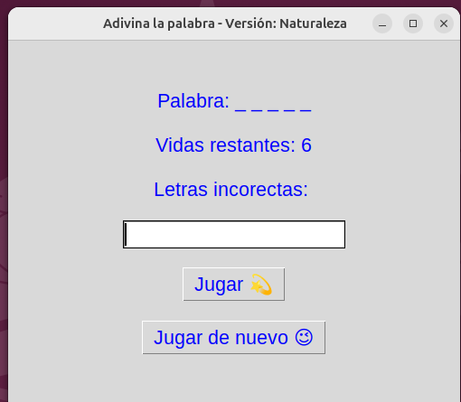

# 🎮 Adivina la Palabra -Juego en Python con Tkinter

Este proyecto consiste en el desarrollo de un **juego interactivo de adivinanza de palabras**, similar al juego del ahorcado, implementado en **Python** utilizando una **interfaz gráfica con Tkinter**.

---

## 🧠 Descripción del juego

- Al iniciar el juego, el programa selecciona una palabra al azar.
- La palabra se muestra oculta utilizando guiones bajos (`_`).
- El jugador ingresa letras de a una por vez.
- Si la letra es incorrecta, se pierde una vida.
- El juego finaliza cuando el jugador adivina la palabra o se queda sin vidas.

---

## 💻 Interfaz gráfica

La interfaz gráfica fue desarrollada utilizando **Tkinter** e incluye:

- Visualización de la palabra oculta
- Contador de vidas restantes
- Lista de letras incorrectas
- Campo de texto para ingresar letras
- Botón para jugar cada turno
- Botón para jugar de nuevo


 
   

La interacción se realiza mediante eventos, sin uso de bucles infinitos

---

## 🛠️ Tecnologías utilizadas

- Python
- Tkinter
- Modulo `random`

---

## ▶️ Cómo ejecutar el proyecto

### Requisitos

Tener instalado:

- Python
- Tkinter

En sistemas basados en Ubuntu:

```bash
sudo apt update
sudo apt install python3 python3-tk

### Ejecutar en consola

python3 game.py


## 🎯 Objetivos del proyecto

- Practica lógica de programación en Python
- Aprender a trabajar con interfaces gráficas
- Comprender el modelo de programación orientada a eventos
- Separar estado del juego y presentación visual

## 🌟 Agradecimientos y Autoria

- Agradecimientos: a la Ing. Alicia San Román y ADA por brindarme el espacio y tiempo para este aprendizaje.  
- Proyecto desarrollado por Laura Marcelli en el marco de la cursada de Introducción a Python dictado por ADA.


